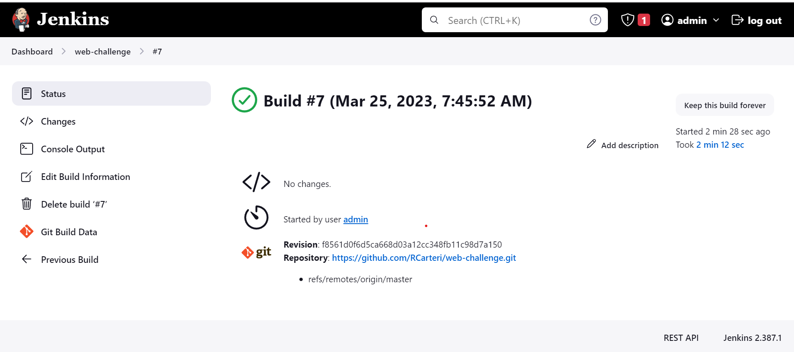

# QA Test WEB challenge

## PROJECT (Website)
Create an automation project using the website [UltimateQA][site] register and also contains the following scenarios (in BDD):
- Login Success (if using the registration login, it will be a differential/plus).
- Invalid login.
- Blank Login.
  Required: Use page objects pattern.
  Desirable: Generate test report.

## Environment
- Java 17
- Maven 3.9.0

## Execution
This code can be executed by [runner][runners], by [feature][features] and with maven by [pom.xml][pom]. Reports are generated after execution and are saved in the directory referring to the execution time.

It was also implemented in jenkins using the git repository.

[site]: https://courses.ultimateqa.com/
[runners]: src/test/java/runners
[features]: src/test/resources/features
[pom]: pom.xml